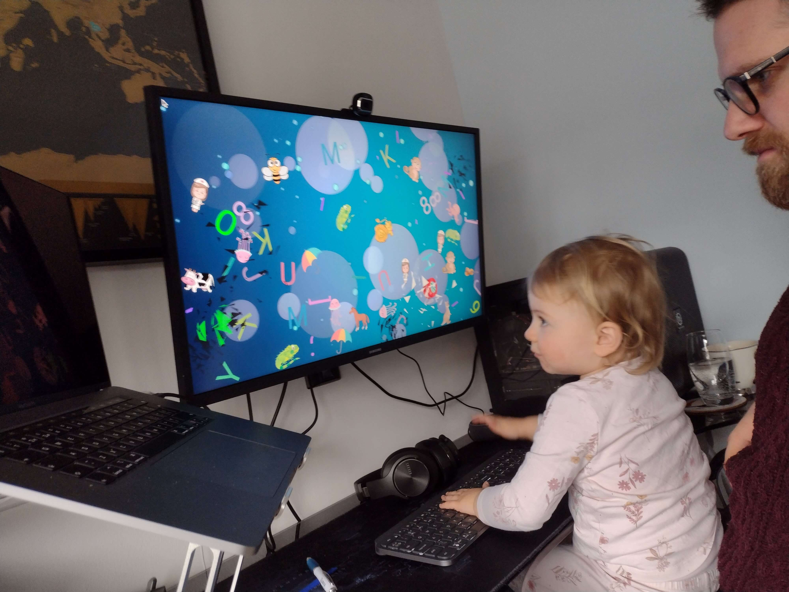

# Baby Smash

Cross platform, physics based game for toddlers.
Built for my one-year-old so she can non-destructively join in with me working from home
(plus I wanted to do some cross-platform physics & graphics programming in modern C++).

* Full screen & toddler safe (currently only on mac). On macos you must force close via ⌘ + ⌥ + ESC. *TODO implement toddler safety on Windows & Linux platforms*.
* Random dynamic backgrounds.
* Each key press (smash) generates a letter, number or object & plays a sound. *TODO add the control keys, make sure all keys mapped correctly through SDL eg numpad*
* Objects are realistically simulated in a 2D physics model.
* After a few collisions, objects will explode into particles.
* All graphics & sounds are [easily replaceable](#custom-assets), which is a good thing as most provided are absolutely terrible - pulled together as a POC in a single evening.



> Note the [expensive keyboard](https://www.logitech.com/en-gb/products/keyboards/mx-keys-wireless-keyboard.html) getting baby-smashed... Yeah I wouldn't recommend that.

## Installing

Download & unpack the release for your platform.

* **macos (Darwin)** Unzip & move the 'baby-smash' application to the Applications folder.
  When the toddler safe sandbox is enabled (default) then you must [grant accessibility permissions to 'baby-smash'](https://support.apple.com/en-gb/guide/mac-help/mh43185/mac).
  Side note: this gives baby-smash permission to intercept ALL user input events as if it were a keylogger!
  Writing this application opened my eyes to the severity of the accessibility permissions on macos.
  **Only ever grant accessibility permissions for apps that you trust or have built from reviewed source yourself!**
* **Ubuntu/Debian** `sudo apt install ./baby-smash-*.deb` & run the 'Baby Smash' application
* **Windows** Unzip & run, the binary is portable.

## Building

### Dependencies

Runtime dependencies are resolved via vcpkg and github.
There are some build dependencies.

**macos**

Use xcode and [homebrew](https://brew.sh/).

```bash
# TODO verify this still works
brew install cmake git sdl2 sdl2_gfx sdl2_image sdl2_mixer
```

**Ubuntu 22.04**

```bash
sudo apt install git build-essential cmake zip unzip curl nasm pkg-config libsdl2-dev libsdl2-gfx-dev libsdl2-image-dev libsdl2-mixer-dev
```

**Windows**

Use [MSYS2](https://www.msys2.org/#installation).

```bash
pacman -S git mingw-w64-x86_64-cmake mingw-w64-x86_64-toolchain mingw-w64-x86_64-SDL2 mingw-w64-x86_64-SDL2_gfx mingw-w64-x86_64-SDL2_image mingw-w64-x86_64-SDL2_mixer
```

### Building

```bash
git clone --recurse-submodules https://github.com/axle-h/baby-smash
cd baby-smash
cmake -DCMAKE_BUILD_TYPE=Release -S . -B build
cmake --build ./build --target baby-smash -- -j8
```

To run:

* **macos** Double click `baby-smash` in the Finder
* **Ubuntu** `./baby-smash`
* **Windows** `./baby-smash.exe`

To package:

```bash
cmake --build ./build --target package
```

## Config

Config is stored in JSON.

* **macos** `"~/Library/Application Support/axle-h/baby-smash/config.json"`
* **Linux** `~/.local/share/axle-h/baby-smash/config.json`
* **Windows** `~/AppData/Roaming/axle-h/baby-smash/config.json`

## Custom Assets

All assets can easily be replaced.

### Sprites

Sprites consist of.

* Physics models so the physics engine knows how sprites should collide.
  These are just optimised collections of triangles & are generated from source images via svg path tracing & triangulation.
* Images for efficient rendering with SDL. SDL can render images all day long but ask it to draw a few thousand polygons and it will crawl.

Images are stored in a sprite sheet and physics models in a json file.
Both of these are generated from source images & fonts with a node script.

1. Install [node 14.x](https://nodejs.org/en/) & [yarn](https://yarnpkg.com/getting-started/install).
2. Update images & fonts as required in [asset-factory](./asset-factory).
    * Images should be PNG with transparent background and have max width or height of 500px.
    * Fonts should be TTF and support massive sizes, Google fonts seem to work OK.
3. Run asset factory script and copy `sprites.*` to `assets` folder.

```bash
./update-assets.sh
```

You can debug newly added sprites by enabling the `render.debugPhysics` option in the [config](#config) file.

### Audio & Video

Video is decompressed at runtime via `ffmpeg` so pretty much any format should work as long as you have the codec.
Audio is handled by `SDL_mixer`, only the ogg codec is initialized.
Baby smash will look for.

* **Audio** ogg
* **Video** mp4, mov

To update audio & video, just drop compatible files into the relevant [assets](./assets) folder.

* **create** Played when a sprite of the same name is created.
* **destroy** Randomly chosen sound is played when any sprite is destroyed.
* **music** Loops in the background.

## Attribution

* Inspired by Scott Hanselman's excellent (but sadly Windows only) [Baby Smash](https://www.hanselman.com/babysmash).
* Sound Effects: https://www.zapsplat.com
* Music: https://www.bensound.com