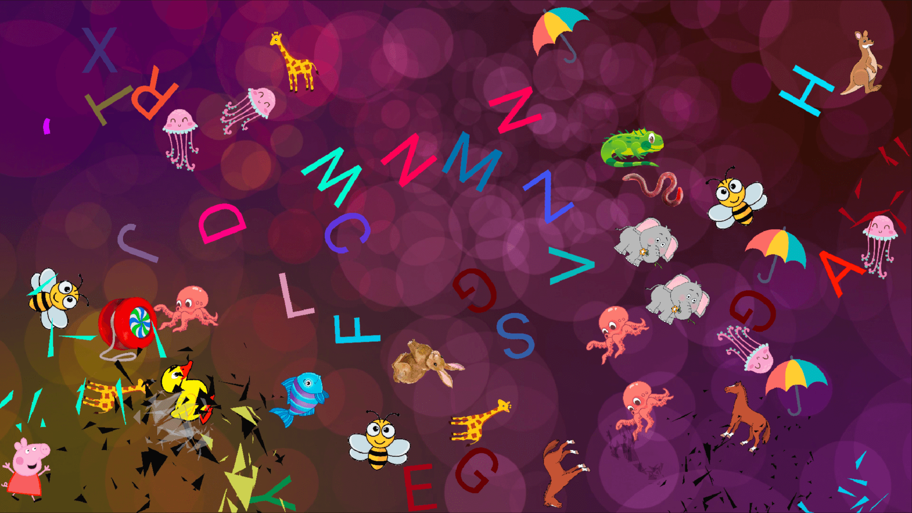

# Baby Smash

Cross platform, physics based game for toddlers.
Built for my one-year-old so she can non-destructively join in with me working from home
(plus I wanted to do some cross-platform physics & graphics programming in modern C++).

* Full screen & toddler safe - must force close via ⌘ + ⌥ + ESC. TODO what happens on Ubuntu & Windows?!
* Random dynamic backgrounds
* Each key press (smash) generates a letter or object & plays a sound
* Objects are realistically simulated in a 2D physics model
* After a few collisions, objects will explode into particles
* All graphics & sounds are [easily replaceable](#custom-assets)



## Installing

I haven't managed to get CMake to build nice installable bundles yet (I'm not a C++ developer!),
so I'm afraid it's build from source only.

## Building

### Dependencies

**macos**

Use [homebrew](https://brew.sh/).

```
brew install cmake git ffmpeg sdl2 sdl2_gfx sdl2_image
```

**Ubuntu 20.04**

```
sudo apt install build-essential cmake git libsdl2-dev libsdl2-gfx-dev libsdl2-image-dev libavcodec-dev libavformat-dev libswscale-dev libswresample-dev
```

**Windows**

Use [MSYS2](https://www.msys2.org/#installation).

```bash
pacman -S cmake git mingw-w64-x86_64-ffmpeg mingw-w64-x86_64-SDL2 mingw-w64-x86_64-SDL2_gfx mingw-w64-x86_64-SDL2_image
```

### Building

```bash
git clone https://github.com/axle-h/baby-smash
cd baby-smash
mkdir build && cd build
cmake -D CMAKE_BUILD_TYPE=Release ..
make -j8
cd bin
./baby-smash
```

## Config

Config is stored in JSON.

* **macos** `~/Library/Application Support/axle-h/baby-smash/config.json`
* **Linux** `~/.local/share/axle-h/baby-smash/config.json`
* **Windows** `%APPDATA%/axle-h/baby-smash/config.json`

## Custom Assets

All assets can easily be replaced.

### Sprites

Sprites consist of.

* Physics models so the physics engine knows how sprites should collide.
  These are just optimised collections of triangles & are generated from source images via svg path tracing & triangulation.
* Images for efficient rendering with SDL. SDL can render images all day long but ask it to draw a few thousand polygons and it will crawl.

Images are stored in a sprite sheet and physics models in a json file.
Both of these are generated from source images & fonts with a node script.

1. Install [node 14.x](https://nodejs.org/en/) & [yarn](https://yarnpkg.com/getting-started/install).
2. Update images & fonts as required in [asset-factory](./asset-factory).
    * Images should be PNG with transparent background and have max width or height of 500px.
    * Fonts should be TTF and support massive sizes, Google fonts seem to work OK.
3. Run asset factory script and copy `sprites.*` to `assets` folder.

```bash
./update-assets.sh
```

You can debug newly added sprites by enabling the `render.debugPhysics` option in the [config](#config) file.

### Audio & Video

These are decompressed at runtime via `ffmpeg` libraries so pretty much any format should work as long as you have the codec.
Baby smash will look for.

* **Audio** mp3, mp4, m4a
* **Video** mp4, mov

To update audio & video, just drop compatible files into the relevant [assets](./assets) folder.

* **create** Played when a sprite of the same name is created.
* **destroy** Randomly chosen sound is played when any sprite is destroyed.
* **music** Loops in the background.

## Attribution

* Inspired by Scott Hanselman's excellent (but sadly Windows only) [Baby Smash](https://www.hanselman.com/babysmash).
* Sound Effects: https://www.zapsplat.com
* Music: https://www.bensound.com